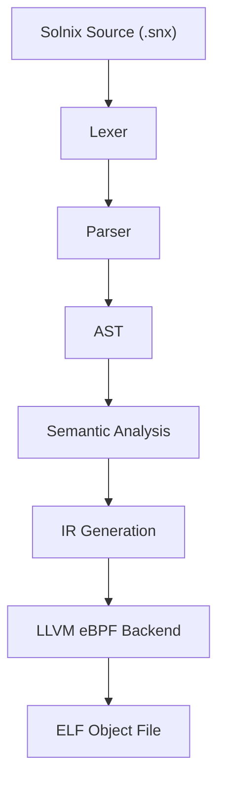

# Solnix Compiler Architecture — Overview

This document provides a high-level overview of the Solnix compiler
architecture and how source programs are transformed into
verifier-safe eBPF object files.

Solnix is designed with **eBPF verifier constraints as a first-class
concern**, not as an afterthought.

---

## Goals

The Solnix compiler is built to achieve the following:

- Generate **kernel-verifier-friendly eBPF programs**
- Provide **strong static guarantees** before kernel load time
- Keep the compiler **small, explicit, and auditable**
- Leverage **LLVM’s mature eBPF backend**
- Maintain a **clear separation** between frontend, analysis, and backend

---

## High-Level Pipeline

At a high level, the Solnix compiler follows a traditional multi-stage
compiler pipeline:

```
Source (.snx)
 → Lexer
 → Parser (AST)
 → Semantic Analysis
 → IR Generation
 → LLVM eBPF Backend
 → ELF Object (.o)
```

---

## Architectural Diagram



---

## Frontend

### Lexer
The lexer converts raw source text into a stream of tokens.
It is intentionally simple and does not perform semantic checks.

Responsibilities:
- Tokenization
- Keyword recognition
- Source location tracking

---

### Parser
The parser consumes tokens and produces an **Abstract Syntax Tree (AST)**.

Responsibilities:
- Grammar enforcement
- AST construction
- Syntax-level error reporting

The parser does **not** perform type checking or verifier validation.

---

## Semantic Analysis (Verifier-Aware Stage)

Semantic analysis is the most critical stage of the Solnix compiler.

This phase enforces rules required by the Linux eBPF verifier **before**
code generation.

Key responsibilities:
- Type checking
- Stack usage tracking (≤ 512 bytes)
- Bounded loop validation
- Prohibition of recursion
- Pointer and context safety
- Map access validation
- Helper function correctness

Any program that passes this stage is expected to be **verifier-safe by
construction**.

---

## Intermediate Representation (IR)

After semantic validation, the AST is lowered into an intermediate
representation.

Currently, Solnix targets **LLVM IR**, allowing the compiler to reuse
LLVM’s optimization and eBPF lowering infrastructure.

Responsibilities:
- Explicit control flow
- Typed values
- Verifier-friendly lowering patterns

---

## Backend

### LLVM eBPF Backend

LLVM is responsible for:
- Instruction selection
- Register allocation (r0–r10)
- ABI compliance
- Target-specific lowering (`bpf`, `bpfel`, `bpfeb`)

Solnix relies on LLVM to produce correct eBPF machine code, while the
compiler frontend ensures verifier acceptance.

---

## ELF Object Emission

The final output of the compiler is an ELF object file containing:

- `.text` — eBPF instructions
- `.maps` — map definitions
- `.license` — program license
- `.version` — kernel version (if required)
- Relocations for map and helper resolution

The ELF object can be loaded using:
- `bpftool`
- `ip link`
- `tc`
- or a custom loader

---

## Repository Responsibilities

This architecture is implemented across multiple repositories:

- **solnix-compiler**  
  Zig implementation of the compiler pipeline

- **solnix-cli**  
  User-facing command-line interface

- **solnix-docs**  
  Architecture, language design, and specifications (this repository)

---

## Design Philosophy

> Solnix does not attempt to outsmart the kernel verifier.  
> It aims to make invalid programs impossible to express.

All language and compiler design decisions are driven by this principle.

---

## Next Documents

- Compiler Pipeline Details
- Verifier Model
- LLVM Backend
- ELF Layout
