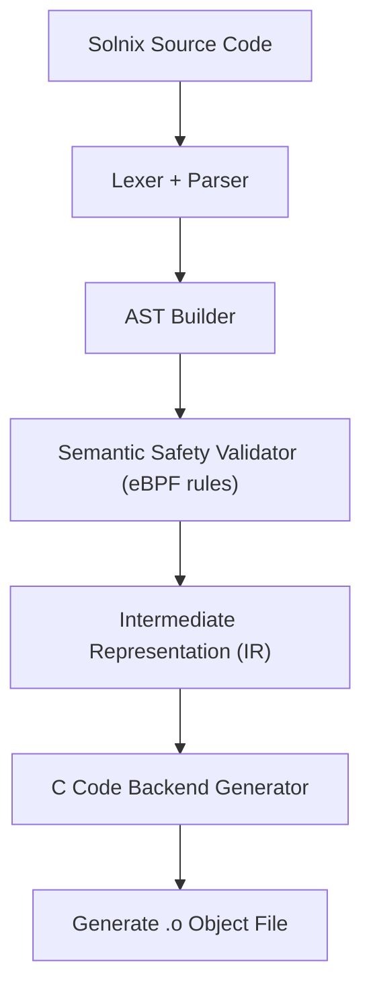

# Architecture

## Pipeline Design

## Backend Strategy

- Compiler directly emits C source code  
- Kernel eBPF program struct and logic are generated in C  
- Lightweight translation layer only    

## Implementation Stack

- Compiler Core → Rust  
- Output Target →  C backend code  
- Verification → Built-in Solnix safety checker

---

### Help Us Build Solnix
Interested in working on the parser, IR, or backend? Check out our [Compiler Contribution Guide](../contributing/compiler-contrib.md) to get started!
