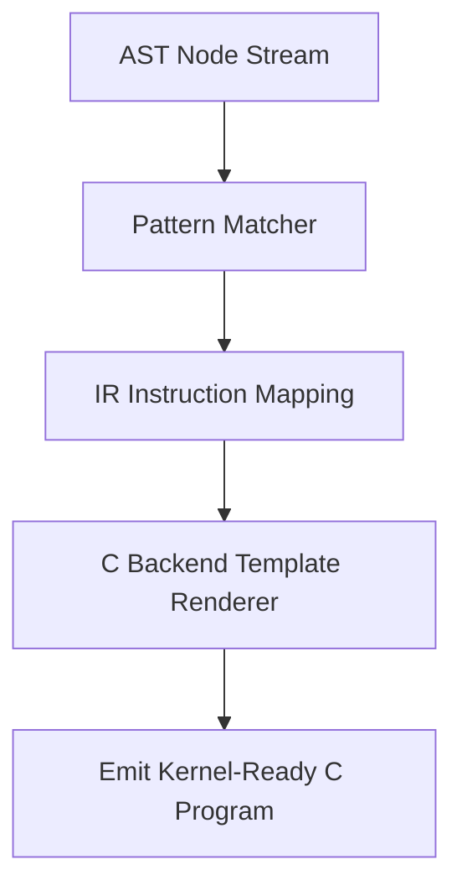

# Code Generation Engine

## Purpose

Solnix code generator translates AST / IR nodes directly into C backend source code for eBPF execution.

## Codegen Workflow

## Code Emission Model

### Function Generation

- Each Solnix function is converted into a C function block  
- Entry hooks are mapped to eBPF program entry points  
- Control flow is expanded into C logic statements  

### Program Structure Output

Generated code contains:

- Map declarations  
- Program entry handlers  
- Instruction execution body  
- Return path validator  

## Safety Rules During Codegen

- Reject unsafe memory access patterns  
- Validate loop constructs  
- Check register allocation consistency  
- Verify kernel verifier compatibility  

## Backend Format

Output =  C source file