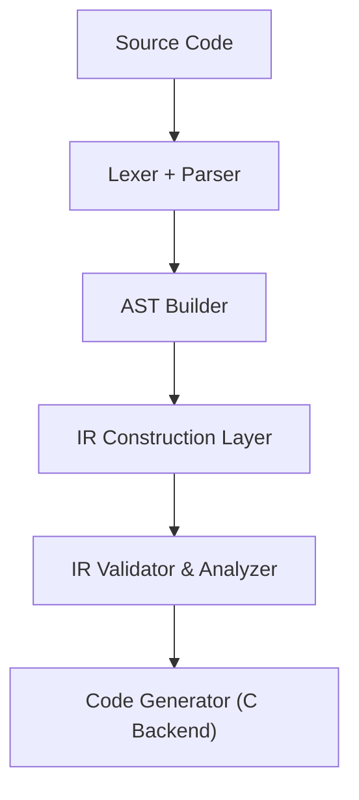

# IR Design

## Overview

Solnix IR is a lightweight internal compiler representation used between the parsing phase and C backend code generation. It provides a formal structure that allows the compiler to perform optimizations and safety checks without being tied to the high-level syntax of the source code or the low-level details of the C backend.

The IR layer is inspired by compiler infrastructure concepts similar to the LLVM Project, but Solnix IR is intentionally simpler and deterministic for kernel-level execution safety. By maintaining a strict, non-ambiguous format, the IR ensures that every instruction can be statically verified against eBPF verifier constraints before any code is emitted.

IR is not exposed to developers. It is only used inside the compiler pipeline.

## Role of IR in Compiler Pipeline

## Design Philosophy

- **SSA (Static Single Assignment) Lite**: Solnix utilizes a simplified SSA form to track data flow efficiently while keeping the compiler footprint small.
- **Direct Mapping**: Every IR instruction has a predictable mapping to eBPF-compatible C constructs to prevent "hidden" complexity.
- **Safety First**: The validator runs directly on the IR to catch out-of-bounds access and infinite loops early in the build process.

---

### Dive into the IR
Want to help optimize our intermediate representation? Check out the [Compiler Contribution Guide](../contributing/compiler-contrib.md).